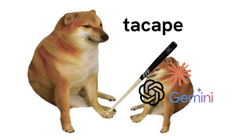

<p align="center">
  <strong>tacape</strong>
</p>

<p align="center">
  
</p>

<p align="center">
  <em>Tacape é uma clava de guerra de madeira. Curto, direto, encerra a conversa.</em>
</p>

<p align="center">
  Seu agente para de enterrar a resposta e passa a escrever código que sobrevive ao review.
</p>

<p align="center">
  <strong>Compressão. Ação primeiro. Regras de engenharia que evitam código obviamente ruim.</strong>
</p>

<p align="center">
  Menos novela no output. Mais erro visível, testes honestos e código fácil de deletar.
</p>

<p align="center">
  <a href="https://github.com/mateussatoh/tacape/stargazers"></a>
  <a href="./INSTALL.md"></a>
  <a href="./tests/run.sh"></a>
  <a href="LICENSE"></a>
</p>

<p align="center">
  <a href="#o-problema-nao-e-que-agentes-falam-demais">Por quê</a> ·
  <a href="#instalacao">Instalação</a> ·
  <a href="#veja-funcionando">Veja funcionando</a> ·
  <a href="#camada-3-a-parte-que-ninguem-mais-entrega">Princípios</a> ·
  <a href="#a-unica-ideia-original">O guard</a> ·
  <a href="#niveis">Níveis</a> ·
  <a href="#numeros-honestos">Números honestos</a> ·
  <a href="#de-onde-vem-os-principios">Créditos</a>
</p>

<p align="center"><a href="./README_en.md">English</a></p>

---

## O problema não é que agentes falam demais

É um pouco.

Mas imagine a resposta de um agente como uma negociação. Uma parte sabe a resposta. Outra quer
explicar cada caso extremo possível. Uma terceira quer fazer a resposta soar prestativa antes de
fazer qualquer coisa prestativa.

O resultado é familiar: você pede uma correção, recebe um pequeno ensaio e descobre o comando que
precisava escondido perto do fim. Você entendeu. Continua sem ter começado.

Aí vem a versão pior. A resposta é curta, a ação vem primeiro, e o código ainda está errado. Valida
a entrada e faz o cast mesmo assim, captura falhas em um log que ninguém monitora, ou sobe sem
teste. Rápido, organizado, inseguro.

São três falhas, e elas se empilham:

1. Volume esconde o fato.
2. Ordem esconde a ação.
3. Engenharia fraca esconde o defeito.

Três falhas, três camadas:

| | Camada | Corrige |
|---|---|---|
| 1 | **Compressão** | Volume. Artigos, filler, hedging, preâmbulo, fechamentos. |
| 2 | **Estrutura** | Ordem. Primeira linha é a ação, passos numerados, um próximo passo no fim. |
| 3 | **Princípios** | O código. Quinze regras agnósticas de linguagem, aplicadas ao escrever e ao revisar. |

Mais um banimento duro do travessão, aplicado por hook em vez de regra de prompt. Isso soa como
obsessão tipográfica. É na verdade a parte mais interessante do repositório, e existe [uma seção
explicando por quê](#a-unica-ideia-original).

## Instalação

**Claude Code**

```bash
claude plugin marketplace add mateussatoh/tacape
claude plugin install tacape@tacape
```

Reinicie a sessão. É isso. Todo o resto desta página já está ligado.

**Codex**

```bash
codex plugin marketplace add mateussatoh/tacape --ref main
codex plugin add tacape@tacape
```

**Gemini CLI**

```bash
gemini extensions install https://github.com/mateussatoh/tacape
```

**Cursor, Windsurf, Cline, Copilot, Aider, Zed, qualquer outro**

Todos eles leem um arquivo de instrução simples:

```bash
curl -fsSL https://raw.githubusercontent.com/mateussatoh/tacape/main/AGENTS.md -o AGENTS.md
```

Depois faça um symlink para o nome que seu agente espera, assim uma cópia só continua sendo a fonte
da verdade. Nomes de arquivo por agente, a rota via registry de skills, comandos de verificação e
desinstalação estão no **[INSTALL.md](./INSTALL.md)**.

> [!TIP]
> Requisitos: Node 18 ou mais novo para os hooks. A instalação por arquivo simples não precisa de nada.

> [!WARNING]
> **Um plugin de estilo por vez.** Dois hooks `SessionStart` sempre ativos injetando regras de estilo
> concorrentes produzem drift, não uma mistura. Desinstale o outro primeiro, e depois confira seu
> arquivo de settings, porque desinstalar um plugin não remove hooks que um instalador standalone
> escreveu direto no settings. Esse modo de falha é real e é silencioso: seu plugin antigo continua
> rodando e você não descobre por que nada mudou.

## Veja funcionando

<table>
<tr>
<th width="50%">Agente padrão</th>
<th width="50%">tacape</th>
</tr>
<tr>
<td valign="top">

> Claro! Fico feliz em ajudar com isso. O problema que você está enfrentando provavelmente é causado
> pelo seu middleware de autenticação não validar corretamente a expiração do token. Deixa eu dar uma
> olhada e sugerir uma correção.

</td>
<td valign="top">

> Bug no middleware de auth. Checagem de expiração usa `<`, precisa de `<=`.

</td>
</tr>
<tr>
<td valign="top">

> Investiguei a migração. Tem algumas coisas acontecendo aqui. A mudança de schema toca três tabelas,
> e você vai querer tomar cuidado com a ordem por causa das foreign keys. Já atualizei a primeira. Me
> avisa se quiser que eu continue com o resto.

</td>
<td valign="top">

> `[1/3] users.tenant_id criada. Próximo: backfill.`
>
> 1. Rode o backfill numa cópia primeiro
> 2. Adicione a FK em `orders.tenant_id`
> 3. Remova a coluna antiga
>
> Cerca de 20 minutos. Próximo: rode o passo 1 e cole a contagem de linhas.

</td>
</tr>
</table>

Olhe a segunda linha de novo. A versão padrão não é muito mais longa. Ela está organizada de modo que
a única frase acionável é "me avisa se quiser que eu continue", que não é uma ação, é um pedido de
permissão para seguir. A camada 2 trata disso, não de contagem de palavras.

Código, comandos e strings de erro nunca são comprimidos. Seu idioma nunca é traduzido: escreva em
português, receba português.

## Camada 3: a parte que ninguém mais entrega

As camadas 1 e 2 moldam o que o agente diz. A camada 3 molda o que ele escreve, que é a parte com a
qual você convive depois.

Mesma tarefa, um agente com os princípios carregados e outro sem:

```diff
- export function getUser(raw: unknown) {
-   if (!isValid(raw)) throw new Error('bad')      // validou, depois esqueceu
-   const u = raw as User                          // o cast é toda a historia de seguranca
-   try { return db.users.find(u.id) }
-   catch (e) { log.info('lookup failed', e); return null }   // ficou mudo
- }
+ export function getUser(raw: unknown): User {
+   const input = UserInput.parse(raw)     // parse uma vez, na borda, para um tipo
+   try {                                  // que nao consegue guardar valor ruim  (regra 7)
+     return db.users.find(input.id)
+   } catch (err) {
+     alert.capture(err, { op: 'getUser' })  // caminho com retry tem que alertar   (regra 6)
+     throw err
+   }
+ }
```

A versão da esquerda passa no review, passa nos testes, e fica muda em produção. Esse é o argumento
inteiro.

<details>
<summary><strong>As quinze regras</strong></summary>

<br>

**1. Chato, pesquisável, seguro de editar.** Óbvio ganha de esperto. Nomeie pelo domínio, não pelo
mecanismo: `activateSubscriptionAfterPayment`, nunca `process`, `handle`, `manager`, `helper`. Um bom
nome é aquele que um estranho procuraria no grep. Comentários explicam POR QUÊ, já que o código já
diz o quê.

**2. Abstraia tarde.** Duplicação é mais barata que a abstração errada. Duas coisas parecidas não são
uma coisa só. Você tem cerca de três fichas de inovação: gaste onde a novidade é o produto, escolha a
opção bem compreendida em todo o resto. A exceção ao "sem dependência para algo pequeno": cripto,
auth, matemática de fuso horário e parsing de formato hostil. Fazer isso na mão é um CVE com seu nome.

**3. Módulos são profundos, não largos.** Julgue uma interface pelo que quem chama precisa entender, e
a implementação por quanto trabalho ela faz por essa pessoa. Uma camada de repasse cujos métodos
mapeiam um para um na camada de baixo tem valor negativo: delete. E defina erros para fora de
existência onde for honesto. Uma operação idempotente não precisa de ramo "já aplicado". Todo erro
eliminado é um ramo que ninguém consegue errar.

**4. Escreva código fácil de deletar.** Você vai estar errado sobre o futuro. Código que dá para
deletar em uma tarde não custa nada quando você erra; código que todo mundo estende custa um
trimestre. Separe em camadas por tempo de vida esperado, para que a integração com o fornecedor e o
experimento possam ser arrancados inteiros. Repita-se para evitar uma dependência, nunca para
gerenciar uma.

**5. Fronteiras são de mão única e verificadas.** Dependências apontam em uma direção. Atravesse pela
interface pública, nunca para dentro dos internos. Verifique a checagem com uma sonda negativa:
escreva o import proibido, confirme que ele realmente falha, depois delete. Uma regra que nunca
dispara em silêncio é indistinguível de uma regra que passa.

**6. Falhas ficam visíveis.** Um erro capturado em um caminho com retry precisa chegar ao sistema de
alerta, não só ao log. Engolir uma exceção em uma linha de log que ninguém monitora é como um sistema
fica quebrado por dias enquanto todo dashboard aparece verde. Nunca faça pattern match no campo de
superfície de um erro embrulhado: percorra a cadeia de causa, ou o próximo bump de versão transforma
um caso tratado em crash.

**7. Torne estados inválidos irrepresentáveis.** Empurre correção para tipos e schemas na borda. Um
comentário dizendo "precisa ser positivo" é um desejo. Faça parse de entrada não confiável uma vez, na
borda. Nunca retorne um registro interno para quem chama sem whitelist dos campos.

**8. Dados e tempo.** Guarde instantes em UTC, renderize no fuso de quem vê. Nunca formate uma data
sem fuso explícito, ou a saída muda dependendo da máquina que rodou. Um store guarda o que o nome
dele diz.

**9. Testes que teriam pego.** Mockar a camada sob teste esconde o bug que você está subindo. Uma
suíte verde porque tudo é falso prova só que os fakes concordam entre si. Determinística, isolada,
rápida. Teste a corrida, a duplicata, o timeout, a lista vazia. Correção de bug sobe com o teste que
reproduz.

**10. Texto e locale.** Texto para o usuário no idioma do produto, identificadores em inglês. Nunca
renderize um enum ou código interno cru para o usuário.

**11. Estados de interface não são opcionais.** Toda view assíncrona trata os quatro: carregando,
vazio, erro, carregado. Tela em branco durante o load é bug, não default.

**12. Segredos e ações destrutivas.** Nunca rode ou sugira um comando que imprima valores secretos.
Confirme antes de qualquer coisa irreversível ou que saia para fora. Aprovação para uma dessas ações
não vale para a próxima.

**13. Ache o arquivo, não faça grep no repositório inteiro.** Mapeie, depois escopo, depois leia.
Busca por nome de arquivo antes de busca por conteúdo. Escopo antes de repositório inteiro. Leia os
testes próximos antes de editar.

**14. Perguntar versus decidir.** Pergunte só quando a resposta muda o resultado e a decisão é de quem
é dono. Não pergunte sobre cosmética ou default convencional. Decida, diga em uma linha, siga.

**15. Documentação faz parte da mudança.** Cada regra mora em exatamente um lugar. Decisões são
append-only: substitua, nunca reescreva. Um doc desatualizado é pior que nenhum doc, porque nele se
acredita.


### Exemplos rápidos

**1. Nome pesquisável**

```ts
// ruim
function process(input) {}

// melhor
function activateSubscriptionAfterPayment(input) {}
```

**2. Abstraia tarde**

```ts
// duas regras parecidas ainda podem divergir
const canRefundOrder = order.status === 'paid'
const canCancelSubscription = subscription.status === 'active'
```

**3. Módulo profundo**

```ts
// ruim: repasse sem decisão
return paymentClient.createInvoice(input)

// melhor: módulo dono da regra
return billing.createRenewalCycle(customerId)
```

**4. Código fácil de deletar**

```ts
// experimento isolado por integração
const checkoutExperiment = createCheckoutExperiment(config)
```

**5. Fronteira de mão única**

```ts
// permitido
import { billing } from '@/billing'

// proibido
import { calculateTax } from '@/billing/internal/tax'
```

**6. Falhas visíveis**

```ts
try {
  await retry(sendWebhook)
} catch (error) {
  alert.capture(error, { operation: 'sendWebhook' })
  throw error
}
```

**7. Estados inválidos irrepresentáveis**

```ts
const UserId = z.string().uuid()
const input = UserId.parse(request.params.userId)
```

**8. Dados e tempo**

```ts
const storedAt = new Date().toISOString()
const label = formatInTimeZone(storedAt, user.timeZone, 'dd/MM/yyyy')
```

**9. Teste que pega bug**

```ts
it('does not create two cycles for duplicate webhook', async () => {
  await handleWebhook(event)
  await handleWebhook(event)
  expect(await countCycles(event.id)).toBe(1)
})
```

**10. Texto e locale**

```ts
// ruim
return status === 'PENDING' ? 'PENDING' : 'PAID'

// melhor
return status === 'PENDING' ? t('payment.pending') : t('payment.paid')
```

**11. Estados de interface**

```tsx
if (loading) return <Spinner />
if (error) return <ErrorState />
if (items.length === 0) return <EmptyState />
return <OrderList items={items} />
```

**12. Segredos e ações destrutivas**

```ts
// ruim
console.log(process.env.STRIPE_SECRET_KEY)

// melhor
await confirm('Delete production customer?')
```

**13. Ache o arquivo**

```text
ruim: grep em todo o repositório sem contexto
melhor: mapear diretório, localizar símbolo, ler teste próximo, editar
```

**14. Perguntar versus decidir**

```text
default convencional: decidir e seguir
decisão de produto ou ação irreversível: perguntar antes
```

**15. Documentação faz parte da mudança**

```text
mudou contrato ou regra: atualize o documento que é dono dela
não espalhe a mesma regra em README, skill e comentário
```

</details>

Texto completo com o raciocínio por trás de cada regra: **[`skills/tacape-code/SKILL.md`](./skills/tacape-code/SKILL.md)**.

> [!IMPORTANT]
> **Precedência, e isso importa.** O `CLAUDE.md`, o `AGENTS.md` e as convenções visíveis do próprio
> repositório alvo sempre ganham desses princípios. O tacape nunca impõe um estilo a uma base de
> código que faz consistentemente de outro jeito. Um guia de estilo que passa por cima da casa onde é
> convidado não é um guia de estilo, é um trator.

## A única ideia original

As camadas 1 e 2 são a fusão de dois plugins existentes, creditados [abaixo](#inspiracao). Esta parte
não é.

A observação é a seguinte. Toda regra que você dá a um agente por prompt é conselho. Ela fica no
contexto competindo com todo o resto, e ao longo de uma sessão longa ela perde. Você já viu isso
acontecer: o agente fica perfeitamente conciso por vinte turnos e depois, devagar, sem avisar, volta a
escrever ensaios. Ninguém desligou. Decaiu.

Existe uma segunda falha que nenhuma regra de prompt corrige. Se o agente cola um template, ou gera um
arquivo a partir de uma string que baixou, ou copia um bloco da documentação, a regra nunca foi
consultada. O caractere chegou de fora da composição do próprio modelo.

Então: pegue uma regra e mova ela do prompt para a camada de ferramentas, onde ela não é conselho e
não decai.

O tacape faz isso com o travessão. Um hook `PreToolUse` em `Write`, `Edit` e `NotebookEdit` percorre
cada string do payload, e se houver um U+2014, a escrita é negada com uma explicação antes de
qualquer coisa tocar o disco. Não é lembrete. É parede.

O alvo é deliberadamente estreito: **só U+2014, só prosa e copy de UI.** A reclamação que o guard
responde é que texto escrito por máquina tem cara de escrito por máquina, e o travessão é o traço mais
forte disso. O escopo segue essa reclamação e para ali. O en dash U+2013 ficou de fora, porque é
correto em intervalo numérico e não carrega nada desse traço. Arquivos que não são prosa são pulados
inteiros: uma fixture de teste, um manifest JSON ou um parser que trata o caractere estão fazendo
trabalho legítimo com ele, e um guard que mira em como o texto é LIDO não tem o que fazer em um
arquivo que ninguém lê como texto.

<details>
<summary><strong>Quatro coisas não óbvias sobre construir isso</strong></summary>

<br>

**O arquivo do guard não pode conter o caractere que ele bane.** Ele guarda o caractere como sequência
de escape em vez de literal, senão falha na própria checagem assim que o teste do repositório roda.

**As três camadas precisam banir exatamente a mesma coisa.** O hook, o pre-commit e o invariante de CI
começaram com três definições ligeiramente diferentes. Isso é três regras, não uma, e a mais frouxa
ensina em silêncio a ignorar a mais rígida. Hoje compartilham um alvo só, e a suíte falha se elas
divergirem.

**O caminho de permissão não pode emitir nada.** A implementação óbvia retorna
`permissionDecision: "allow"` quando o payload está limpo. Isso aprovaria automaticamente toda escrita
da sua sessão, um bug muito pior do que o que o hook corrige. Não emitir nada deixa a chamada cair no
tratamento normal de permissão.

**Uma coisa que erramos e revertemos.** Adicionar `Bash` ao matcher parecia fechar um bypass, já que
`echo "x" > f.md` escreve o que quiser. Fechou o remédio. Uma string de comando não distingue escrever
o caractere de procurar ou remover ele, então `grep -rn "<char>" .` e `sed -i "s/<char>/,/g" f.md`
eram negados. Os dois comandos que você mais precisa em um repositório que bane o caractere. Um guard
que bloqueia a correção é pior que nenhum guard. Escritas via Bash são pegas uma camada abaixo agora,
pelo hook de pre-commit e pelo CI, que olham o resultado em vez de adivinhar intenção.

</details>

> [!NOTE]
> **Escopo, dito com honestidade.** Isso não é garantia em nível de sistema de arquivos. Uma escrita
> feita por um programa que o agente dispara, um formatter ou um passo de codegen ou um redirect de
> shell, está fora do que um hook `PreToolUse` enxerga. O invariante do repositório inteiro pertence ao
> CI, que é onde o tacape checa o dele.

Escape hatch, para um repositório que legitimamente precisa do caractere:

```bash
TACAPE_ALLOW_EMDASH=1 claude
```

O guard é independente do nível de estilo. `/tacape:tacape off` não desliga ele.

## Níveis

| Nível | Mesma frase, encolhida |
|---|---|
| *sem plugin* | Você deveria envolver o objeto em `useMemo`, já que uma nova referência é criada a cada render. |
| `lite` | Envolva o objeto em `useMemo`. Uma nova referência é criada a cada render. |
| `full` *(padrão)* | Nova ref a cada render. Envolva o objeto em `useMemo`. |
| `ultra` | Nova ref por render. `useMemo` nele. |
| `off` | Camada de estilo desligada. Guard continua ligado. |

```
/tacape:tacape          mostra o nível atual
/tacape:tacape ultra    troca
/tacape:tacape off      desliga a camada de estilo
```

Persiste em `~/.claude/.tacape-mode`. `TACAPE_LEVEL=ultra` sobrescreve por uma sessão sem mudar seu
padrão.

**Ele recua sozinho** em avisos de segurança, ações irreversíveis, e qualquer sequência onde palavras
omitidas deixariam a ordem ambígua. Segurança ganha de brevidade, sempre. Também recua quando você
pede para explicar algo: aí ele roda o quanto o assunto exigir, ainda sem preâmbulo e sem fechamento.
Um plugin de brevidade que deixa um agente conciso sobre `rm -rf` é um passivo, não uma feature.

## Statusline

Opcional, só no Claude Code.

```
[TACAPE:FULL] ~/dev/tacape (main*) Opus 4.8
```

Nível, diretório, branch com marcador de sujeira, modelo. Não é ligado automaticamente, porque
sobrescrever uma statusline que você já montou seria grosseria. O tacape oferece uma vez, numa sessão
onde nenhuma está configurada. Setup no [INSTALL.md](./INSTALL.md).

Bash puro, sem node e sem jq, já que roda a cada refresh. Ele se recusa a ler o nível de um symlink,
limita o tamanho da leitura e remove bytes de controle, porque uma statusline escreve direto no seu
terminal e um arquivo plantado injetaria sequências ANSI a cada refresh.

## Números honestos

**O tacape não reporta tokens economizados, e isso é deliberado.**

Todo número de "X% economizado" nesta categoria é uma estimativa contra um contrafactual que ninguém
observou. Você não tem como saber o que o agente *teria* dito sem o plugin, porque ele não disse. Dá
para estimar, e as estimativas não são inúteis, mas são estimativas fantasiadas de medição.

O que dá para dizer com honestidade, sem número:

- **Tokens de saída caem.** Obviamente. É o que a camada 1 faz.
- **Tokens de entrada sobem um pouco.** O conjunto de regras é injetado no `SessionStart`. Não é de graça.
- **Em workloads já concisos o saldo pode ficar negativo.** Se seus prompts são de uma linha e as respostas têm três palavras, você está pagando o custo do ruleset por uma compressão de que não precisava.
- **O ganho real não é dinheiro.** É que você acha a resposta, e que o código que volta tem menos dos defeitos específicos que a camada 3 mira. Custo é efeito colateral.

Uma versão anterior deste README trazia uma tabela de atribuição creditando onze ensaios por ideias
que estavam só parcialmente no arquivo. Uma auditoria pegou. A lição generaliza: este projeto prefere
não entregar número nenhum a entregar um número lisonjeiro. Se um eval A/B medido aparecer depois, o
número vem para cá com o harness do lado.

## De onde vêm os princípios

Duas linhagens, e vale ser preciso sobre qual é qual.

**A fonte imediata são incidentes de produção.** A maior parte destas regras foi escrita na semana
seguinte a algo quebrar. "Um erro capturado em um caminho com retry precisa chegar ao sistema de
alerta" está aqui porque um webhook de pagamento logava as falhas e retornava sucesso, então o gateway
parou de tentar de novo e nada alertou, e o caminho ficou morto por dois dias enquanto todo dashboard
aparecia verde. "Verifique uma regra de fronteira com uma sonda negativa" está aqui porque um config
de lint que parecia correto não estava aplicando nada em silêncio. É por isso que as regras estão
escritas como consequências e não como preferências.

**As ideias por baixo não são originais.** Cada uma destas nomeou a coisa muito antes de ela aparecer
aqui:

| Ideia | Fonte | Regra |
|---|---|:---:|
| Duplicação é bem mais barata que a abstração errada | Sandi Metz, [The Wrong Abstraction](https://sandimetz.com/blog/2016/1/20/the-wrong-abstraction) (2016) | 2 |
| Complexidade é a inimiga, resista ao demônio da complexidade | Carson Gross, [The Grug Brained Developer](https://grugbrain.dev/) (2022) | 1 |
| Fichas de inovação: gaste novidade onde ela é o produto | Dan McKinley, [Choose Boring Technology](https://mcfunley.com/choose-boring-technology) (2015) | 2 |
| Módulos profundos, empurre complexidade para baixo, defina erros para fora de existência | John Ousterhout, A Philosophy of Software Design (2018) | 3 |
| Otimize para deleção, separe camadas por tempo de vida | tef, [Write code that is easy to delete](https://programmingisterrible.com/post/139222674273/write-code-that-is-easy-to-delete-not-easy-to) (2016) | 4 |
| Dependências apontam em uma direção, para dentro | Robert C. Martin, a Dependency Rule | 5 |
| Lógica de decisão pura primeiro, efeitos na casca | Gary Bernhardt, Functional Core / Imperative Shell (2012) | 6, 7 |
| Faça parse de entrada não confiável uma vez, na borda, para um tipo que não consegue estar errado | Alexis King, [Parse, don't validate](https://lexi-lambda.github.io/blog/2019/11/05/parse-don-t-validate/) (2019) | 7 |
| Torne estados ilegais irrepresentáveis | Yaron Minsky, Jane Street, da tradição OCaml | 7 |
| Determinístico, isolado, rápido, comportamento acima de implementação | Kent Beck, Test Desiderata (2019) | 9 |
| A regra de três, e YAGNI | Martin Fowler, Refactoring, creditando Don Roberts | 2 |

Cada linha nomeia a regra que a carrega. Se uma linha algum dia deixar de rastrear até uma regra, a
linha é deletada em vez de manter a autoridade emprestada.

O que o tacape acrescenta não é uma ideia nova. É que um agente aplica isso por padrão, em todo diff,
sem você lembrar de pedir. Ler os ensaios muda o que você acredita. Um arquivo de skill muda o que é
escrito às 2 da manhã.

## Inspiração

Dois plugins resolveram metade do problema cada um, e o tacape deve aos dois.

**[caveman](https://github.com/JuliusBrussee/caveman)** de Julius Brussee é a camada 1. Ele provou que
um agente pode cortar a maior parte das palavras sem perder nada de substância técnica, e, importante,
que o ruleset precisa ser reinjetado a cada sessão ou o modelo volta a ser verboso. Essa única
observação é a semente de todo o argumento da camada de ferramentas acima.

**[i-have-adhd](https://github.com/ayghri/i-have-adhd)** de ayghri é a camada 2. O argumento dele é
que brevidade sozinha não basta: memória de trabalho é pequena, começar é o passo mais difícil, e uma
resposta enterrada não registra. Comece pela ação, numere os passos, termine com uma coisa a fazer.

Eles são ortogonais, compressão é sobre como as palavras aparecem e estrutura é sobre onde as coisas
ficam, mas rodar os dois como plugins separados sempre ativos significa dois prompts de estilo
competindo pelo mesmo trabalho. O tacape funde os dois em um ruleset só e acrescenta o que nenhum tem:
o banimento aplicado por ferramenta e os princípios de engenharia.

## Skills

| Skill | Dispara em |
|---|---|
| `tacape` | Sempre, via `SessionStart`. Compressão e estrutura. |
| `tacape-code` | Escrever, refatorar ou revisar código em qualquer linguagem. |
| `tacape-commit` | "escreva um commit". Conventional Commits, assunto de 50 caracteres, corpo só quando o diff não responde o porquê. |
| `tacape-review` | "revise este diff". Uma linha por achado, ordenado por severidade, limitado a 8 e nunca truncado em silêncio. |

## Desenvolvimento

```bash
bash tests/run.sh                  # 48 asserções, sem framework, sem dependência
bash hooks/install-git-hooks.sh    # guard de pre-commit contra o caractere banido
```

O CI roda o mesmo arquivo a cada push. A suíte cobre os hooks contra entrada adversarial, os
manifests, e asserções que falham quando `AGENTS.md` e `skills/tacape/SKILL.md` divergem, já que são
duas cópias mantidas à mão de um ruleset só.

Isto existe porque os princípios deste repositório exigem testes e regras aplicadas por ferramenta, e
nos três primeiros commits o tacape não tinha nenhum dos dois. Uma auditoria apontou isso,
corretamente, como o achado que derrubava todo o resto que ele afirma. Um plugin que argumenta que
regras de prompt decaem e pertencem à camada de ferramentas precisa manter as próprias regras na
camada de ferramentas também, ou é um post de blog com um manifest.

## Compare estilos de instrução

Rode o benchmark da OpenAI contra instruções neutras, Caveman, i-have-adhd e tacape:

```bash
python3 benchmarks/run-openai.py --dry-run
OPENAI_API_KEY=... python3 benchmarks/run-openai.py
```

Mesmos prompts, mesmo modelo, formato de requisição fixo, trials repetidos, mediana de tokens de
saída. O benchmark reporta dados para este conjunto de prompts. Ele não afirma superioridade
universal.

## O que ele deliberadamente não faz

Sem contabilidade de token em runtime. Sem subagentes. Sem statusline ligada sem perguntar. Ele molda
saída e codifica princípios, nada além disso.

## Licença

MIT.
